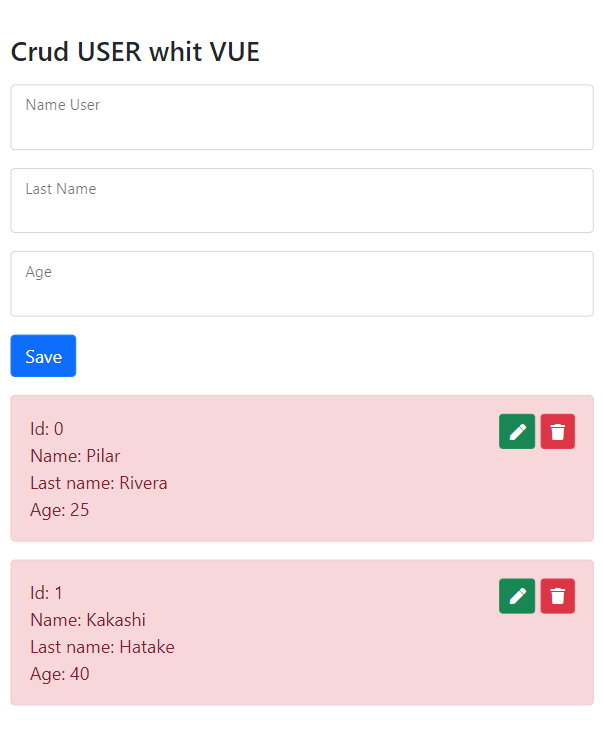
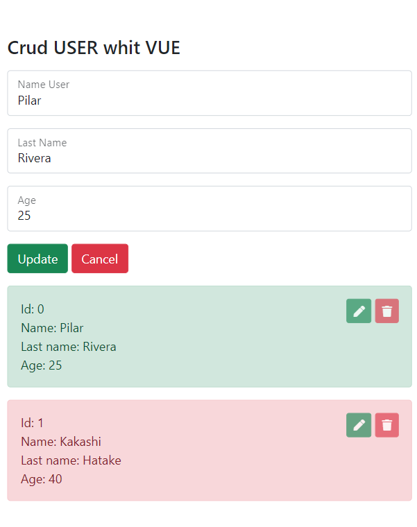

# Challenge CRUD VUE.JS
## Project features 
- Mobile friendly
- Languages and tools used for development : 

<code></code>
<code></code>
<code></code>
<code></code>
<code></code>
<code></code>

## Application functionality

The ability to create, read, update, and delete items in a web application is crucial for most projects. It is for her that this challenge performs the four functions of persistent storage.

In this case, a CRUD of users is performed using localStorage to persist data.

## End interface views

### Desktop view

## Developer

### Pilar Rivera

 * <code></code>

  * <code></code>
  